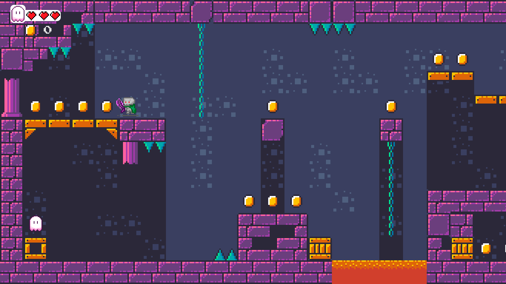

# Projeto Final de Linguagem de Programação
### Alunos envolvidos:
INGRIDY LOPES DA SILVA (Matrícula 20210085653)
JULIANE DA SILVA SANTOS (Matrícula 20200075288)

O objetivo deste projeto é aplicar os conceitos aprendidos em sala de aula na disciplina de linguagem de programação, utilizando Python 3 como linguagem de desenvolvimento.

O projeto consiste na criação de um jogo utilizando a biblioteca PyGame em Python. Para a parte visual do jogo, foram utilizadas ferramentas de desenho, como o Aseprite, e de edição de imagem, como o Photoshop. Para a construção do cenário, foi empregada a plataforma TiledMap. Atualmente, o jogo possui apenas uma fase, que inclui:

- Detecção de colisão entre os personagens.
- Redução de vidas do jogador após colisões.
- Movimentação do personagem principal nas direções: direita, esquerda, cima e baixo.
- Movimentação dos inimigos nas direções: direita e esquerda.
- Utilização de poderes pelo personagem principal através da tecla 'x'.
